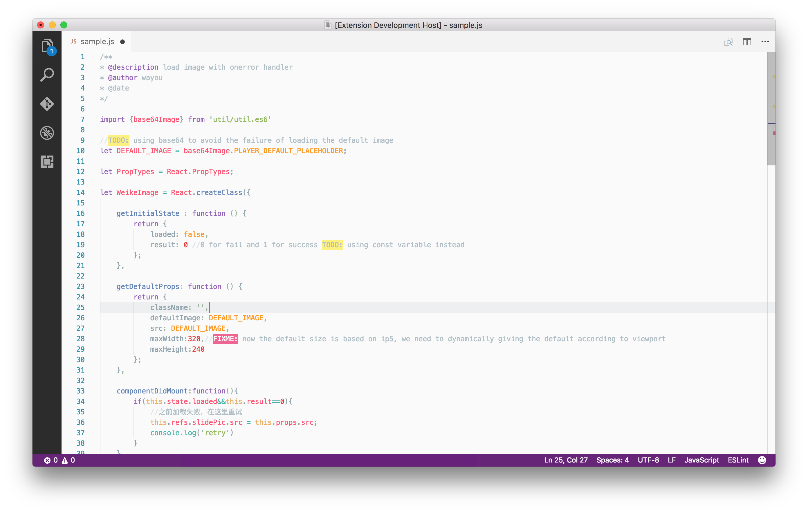
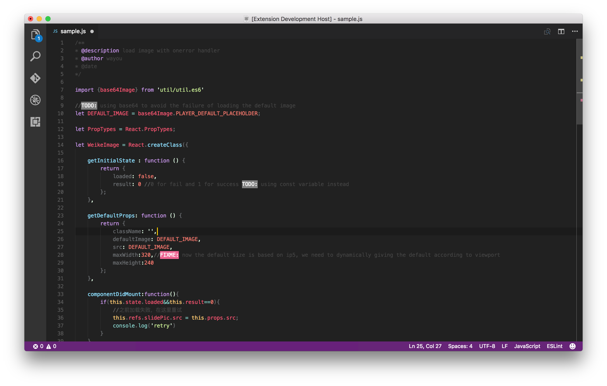

Highlight `TODO`,`FIXME`(or whatever other annotations,but for now these two) within your code.

Sometimes you will forget to review the TODOs added while coding till publish the code to production.
So I've been long for an extension to highlight them and remind me know there're notes or things not done.

Hope this extension helps you as well.

### Preview

- with `material night` color theme:

- with `material night eighties` color theme:

Icons made by <a href="http://www.flaticon.com/authors/madebyoliver" title="Madebyoliver">Madebyoliver</a> from <a href="http://www.flaticon.com" title="Flaticon">www.flaticon.com</a> is licensed by <a href="http://creativecommons.org/licenses/by/3.0/" title="Creative Commons BY 3.0" target="_blank">CC 3.0 BY</a>
