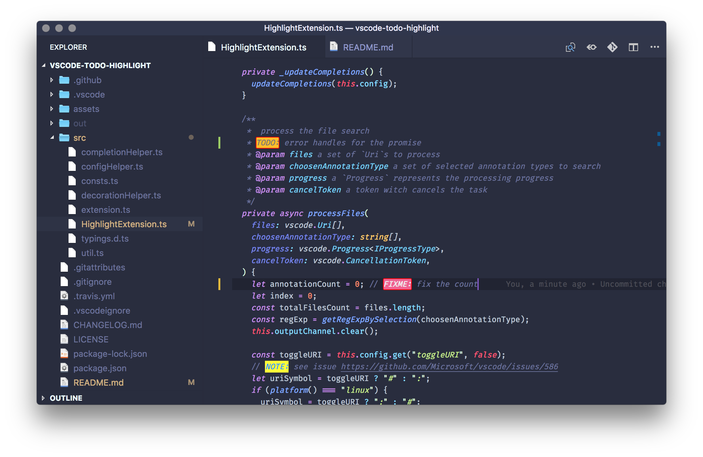
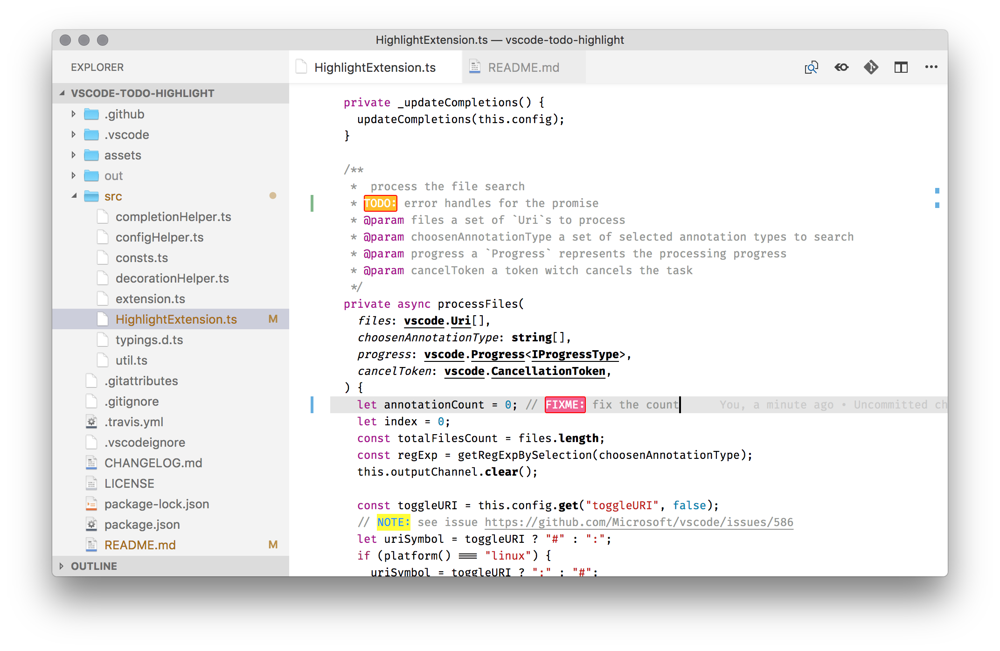
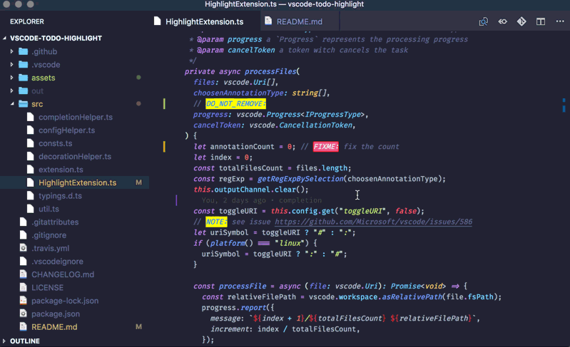

vscode-todo-highlight README
---
[](https://opensource.org/licenses/MIT) [](https://travis-ci.org/wayou/vscode-todo-highlight) [](https://marketplace.visualstudio.com/items?itemName=wayou.vscode-todo-highlight) [](https://marketplace.visualstudio.com/items?itemName=wayou.vscode-todo-highlight) [](https://marketplace.visualstudio.com/items?itemName=wayou.vscode-todo-highlight)

Highlight TODO, FIXME, or whatever annotations.

## Preview

- with dark theme


- with light theme



## Features

### Predefined Annotations

Following annotations are out of the box:

`AVOID:`,
`TODO:`,
`FIXME:`,
`BUG:`,
`CAUTION:`,
`CONFIGURATION:`,
`DEBUG:`,
`DEPRECATED:`,
`DO_NOT_REMOVE:`,
`HACK:`,
`IMPORTANT:`,
`IMPROVE:`,
`INFO:`,
`ISSUE:`,
`KEEP:`,
`LEGACY:`,
`NOTE:`,
`OPTIMIZE:`,
`PERFORMANCE:`,
`PLACEHOLDER:`,
`PREFER:`,
`REFACTOR:`,
`REMOVE:`,
`REVIEW:`,
`RFC:`,
`TEMP:`,
`WARNING:`


### Code completion

Code completion for the annotations.


### Toggle highlight

Enable/disable the highlight.


### List annotations

Supports both for current file and the whole project.




## Extension Commands

This extension contributes the following commands:

- `todohighlight.toggleHighlight`: Toggle highlight
- `todohighlight.listAnnotations`: List annotations in current file...
- `todohighlight.listAllAnnotations`: List all annotations...
- `todohighlight.toggleURI`: Toggle URI pattern


## Extension Settings

This extension contributes the following settings:

- `todohighlight.isEnable`: enable/disable this extension
    - type: boolean
    - default: `true`
- `todohighlight.isCaseSensitive`: whether the keywords are case sensitive or not.
    - type: boolean
    - default: `false`
- `todohighlight.toggleURI`: if the file uri within the output channel is not clickable, set this to true to toggle the uri patten between `<path>#<line>` and `<path>:<line>:<column>`
    - type: boolean
    - default: `false`
- `todohighlight.keywords`: annotations that will be highlighted. The pattern is plain string or escaped RegExp string. e.g. `TODO:`, `\\\\bTODO\\\\b`.
    - type: Array<string|[DecorationRenderOptions](https://code.visualstudio.com/docs/extensionAPI/vscode-api#DecorationRenderOptions)>
    - default: 
```js
[{
    pattern: "TODO:",
    style: {
    dark: {
        color: "#757575"
    },
    light: {
        color: "#fff"
    },
    backgroundColor: "#ffbd2a",
    borderRadius: "2px",
    border: "1px solid red"
    },
    description: "Things need to be done later."
},
{
    pattern: "FIXME:",
    style: {
    dark: {
        color: "#eee"
    },
    light: {
        color: "#fff"
    },
    backgroundColor: "#f06292",
    borderRadius: "2px",
    border: "1px solid red"
    },
    description: "Things need to be fixed."
},
"AVOID:",
"BUG:",
"CAUTION:",
"CONFIGURATION:",
"DEBUG:",
"DEPRECATED:",
"DO_NOT_REMOVE:",
"HACK:",
"IMPORTANT:",
"IMPROVE:",
"INFO:",
"ISSUE:",
"KEEP:",
"LEGACY:",
"NOTE:",
"OPTIMIZE:",
"PERFORMANCE:",
"PLACEHOLDER:",
"PREFER:",
"REFACTOR:",
"REMOVE:",
"REVIEW:",
"RFC:",
"TEMP:",
"WARNING:"
]
```
- `todohighlight.defaultStyle`: default style applied to the annotations. Reference the VS Code extension API to see all available properties https://code.visualstudio.com/docs/extensionAPI/vscode-api#DecorationRenderOptions .
    - type: [DecorationRenderOptions](https://code.visualstudio.com/docs/extensionAPI/vscode-api#DecorationRenderOptions)
    - default: 
```js
{
    "color": "#2196f3",
    "backgroundColor": "#fffd38"
}
```
- `myExtension.include`: a set of glob patterns that defines the files to search for. Each of the item is a glob pattern to include the files while searching for annotations. e.g. `**/*.jsx`.
    - type: string[]
    - default: `["**/*"]`
- `myExtension.exclude`: a set of glob patterns that exclude files or directories while searching annotations. Each of the item is a glob pattern to include the files while searching for annotations. e.g. `**/*.jsx`
    - type: string[]
    - default: `["**/*"]`
```js
[
    "**/.next/**",
    "**/.vscode/**",
    "**/*.map",
    "**/*.min.*",
    "**/bower_components/**",
    "**/dist/**",
    "**/node_modules/**"
]
```


## Known Issues

### File uri in the output channel
 The clickable file pattern within the output channel differs from OS platform(`<path>#<line>` for Mac/Windows and `<path>:<line>:<column>` for Linux, for details see this [issue](https://github.com/Microsoft/vscode/issues/586) ). 

 Basically the extension auto detects the OS platform.

 If you find that the file path is not clickable, set `todohighlight.toggleURI` to `true` to toggle the file pattern.
  

### Avoid unwanted partial highlight

Word boundary detect. The hard part is `\b` only work with a [predefined chracter collection](http://www.ecma-international.org/ecma-262/5.1/#sec-15.10.2.6). That means, `\\bTODO:\\b` just won't work as ecpected.As for at present I can not do the boundray detect within the extension internal for the annotaions from user config. The good news is that with todohighlight v1 all patterns are defined with RegExp, so you can decide what is your doundary to match and meet your own requirments. For example, `\\bBUG:` match exactlly `BUG:` and skip `DEBUG:`. Related issues #48.


### Code completion not working in comment

Currently the code completion cannot working in comment. You can first type the annotations out then comment it out.


## Release Notes

See [CHANGELOG](./CHANGELOG.md).


## Misc

- For bugs report and feature request, file an issue on [Github](https://github.com/wayou/vscode-todo-highlight/issues)


**Enjoy!**
